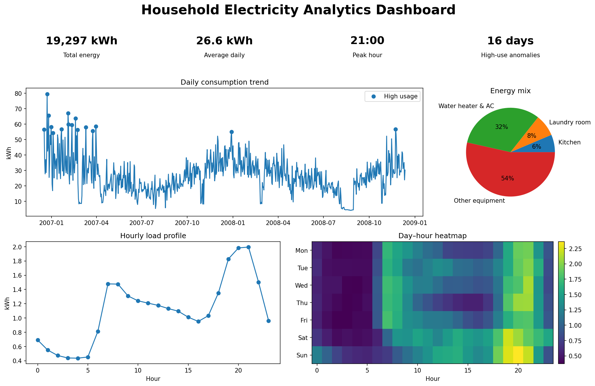

# ⚡ Household Electricity Analytics

An end-to-end **Python data analysis and Streamlit dashboard** project
that explores minute-level household electricity consumption, recurring
load patterns, sub-metering composition, anomalies, and data quality.



## Project overview

The analysis uses a portfolio-sized CSV subset of the UCI
**Individual Household Electric Power Consumption** dataset. The supplied
file contains **1,048,575 one-minute observations**
from **16 December 2006** to **13 December 2008**.

The full UCI dataset contains 2,075,259 observations collected in a
household in Sceaux, France, between December 2006 and November 2010.
This repository intentionally analyzes the supplied subset rather than
claiming coverage of the complete UCI period.

## Business questions

1. When does household electricity demand reach its daily peak?
2. Is weekend electricity consumption different from weekday usage?
3. Which metered household areas account for the largest energy share?
4. Which days exhibit unusually high consumption?
5. How much of the data is complete enough for reliable aggregation?

## Key findings

- Average consumption on weekends was
  **22.4% higher** than on weekdays
  (30.6 versus
  25.0 kWh per complete day).
- The average hourly load peaked at **21:00**,
  while its lowest point occurred around
  **04:00**.
- The highest complete-day consumption was
  **79.6 kWh** on
  **2006-12-23**.
- The IQR rule flagged **16**
  high-usage days.
- **Other equipment** accounted for
  **53.5%** of
  measured energy; the water-heater and air-conditioner sub-meter
  accounted for
  **32.1%**.
- The raw file had **4,069 rows**
  (0.39%) with missing measurements.
  The pipeline interpolated
  **193 short-gap rows** and left
  longer gaps missing.

## Data-cleaning strategy

- Convert `?` placeholders to missing values.
- Parse `Date` and `Time` into a single minute-level timestamp.
- Convert all measurement columns to numeric types.
- Interpolate only consecutive missing runs of **60 minutes or less**.
- Preserve longer gaps and calculate hourly/daily `coverage_pct`.
- Convert active power to energy:
  `energy_kwh = Global_active_power / 60`.
- Derive residual energy not represented by the three sub-meters.
- Detect unusual complete days using the **1.5×IQR rule**.

This approach avoids inventing values across long missing periods and
allows the dashboard user to filter by a minimum coverage threshold.

## Dashboard features

- Date-range, weekday/weekend, and data-coverage filters
- Daily, weekly, and monthly trend aggregation
- KPI cards for energy, average usage, peak day, cost, and anomalies
- Daily anomaly visualization
- Hourly load-profile comparison
- Day–hour heatmap
- Equipment/sub-metering energy composition
- Cost simulator with editable currency and tariff
- Data-quality and coverage monitoring
- Filtered CSV download

## Repository structure

```text
household-electricity-analytics/
├── app.py
├── requirements.txt
├── README.md
├── .streamlit/
│   └── config.toml
├── assets/
│   ├── dashboard_preview.png
│   ├── daily_energy_trend.png
│   ├── hourly_profile.png
│   ├── day_hour_heatmap.png
│   └── component_share.png
├── data/
│   ├── raw/
│   │   └── household_power_consumption.csv
│   └── processed/
│       ├── electricity_hourly.csv
│       ├── electricity_daily.csv
│       ├── data_quality_summary.csv
│       └── insights.json
├── notebooks/
│   └── household_electricity_analysis.ipynb
└── src/
    └── data_pipeline.py
```

## Run locally

```bash
python -m venv .venv
```

Activate the environment, then install dependencies:

```bash
pip install -r requirements.txt
```

Rebuild processed data when needed:

```bash
python src/data_pipeline.py
```

Run the dashboard from the repository root:

```bash
streamlit run app.py
```

## Deploy with Streamlit Community Cloud

1. Upload this folder to a GitHub repository.
2. Open Streamlit Community Cloud and connect the GitHub account.
3. Select the repository, branch, and `app.py`.
4. Deploy the application.

The repository keeps `app.py`, `requirements.txt`, and the processed
files available from the repository root so deployment paths remain
consistent.

## Limitations

- The data describe a single household, so the findings cannot be
  generalized to all households.
- The supplied CSV is a subset of the full UCI time period.
- IQR anomalies indicate statistical unusualness, not faults, fraud,
  or causal explanations.
- Estimated cost depends entirely on the tariff entered by the user.
- Long missing periods are excluded rather than imputed.

## Dataset attribution

Hebrail, G. & Berard, A. (2006).
*Individual Household Electric Power Consumption*.
UCI Machine Learning Repository.
DOI: `10.24432/C58K54`.

Dataset license: **Creative Commons Attribution 4.0 International
(CC BY 4.0)**.
